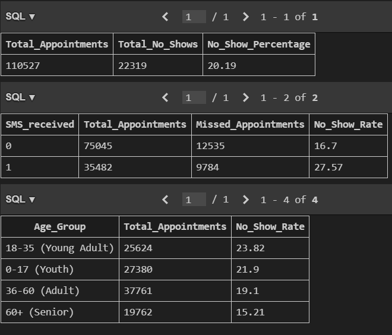

# Healthcare Operations Analysis: No-Show Prediction

## Project Overview
**The Business Problem:** A major healthcare provider was experiencing a **20% appointment no-show rate**, leading to operational inefficiencies and revenue loss.
**The Goal:** Analyze 110k+ appointment records to identify high-risk patient segments and evaluate the effectiveness of the current SMS reminder system.

## Tech Stack
* **Database:** SQLite (Relational DB)
* **ETL Pipeline:** Python (Pandas)
* **Analysis:** SQL (Complex Aggregations, Window Functions, CASE Logic)
* **Tooling:** VS Code

## 📂 Project Structure
* `src/setup_db.py`: Custom Python ETL script to sanitize raw CSV data and load it into SQLite.
* `src/schema.sql`: DDL script to define the database schema and data types.
* `src/analysis.sql`: SQL queries performing the segmentation and risk analysis.

## Key Findings
1.  **The "Young Adult" Risk:** Patients aged **18-35** are the most unreliable demographic, with a **23.8%** no-show rate.
2.  **SMS Inefficiency:** Surprisingly, patients who received SMS reminders had a **higher no-show rate (27.6%)** than those who did not (16.7%). This suggests the current targeting strategy for SMS is ineffective and requires a strategic pivot.
3.  **Chronic Conditions:** Patients with hypertension showed a higher reliability (17% no-show rate) compared to the general population.

## How to Run This Project
1.  **Clone the repository:**
    ```bash
    git clone [https://github.com/YOUR_USERNAME/healthcare-sql-analysis.git](https://github.com/Tayo-Durodola/healthcare-sql-analysis.git)
    ```
2.  **Install Dependencies:**
    ```bash
    pip install -r requirements.txt
    ```
3.  **Run the ETL Pipeline:**
    ```bash
    python src/setup_db.py
    ```
    *(This will generate the `healthcare.db` database file locally)*
4.  **Execute SQL Analysis:**
    Open `src/analysis.sql` in VS Code (using the SQLite extension) to reproduce the findings.

## 📊 Sample Output
